# Company Rooms Reservation

Company needs an internal service for its employees which helps them to reserve company
meeting rooms for internal or external meetings. Each employee should be able to check each
room’s availability, book or cancel a reservation through an API.

## Table of Contents

[Available APIs](#headers)  
[Run in local without docker](#run-in-local-without-docker)  
[Run in local with docker](#run-in-local-with-docker)
[Run test and coverage](#run-test-and-coverage)
[How to use APIs](#how-to-use-apis)
[Project Structures](#project-structures)
[Technologies](#technologies)

## Available APIs

Below is the available APIs for Company Rooms Reservation projects

<p align="center">
    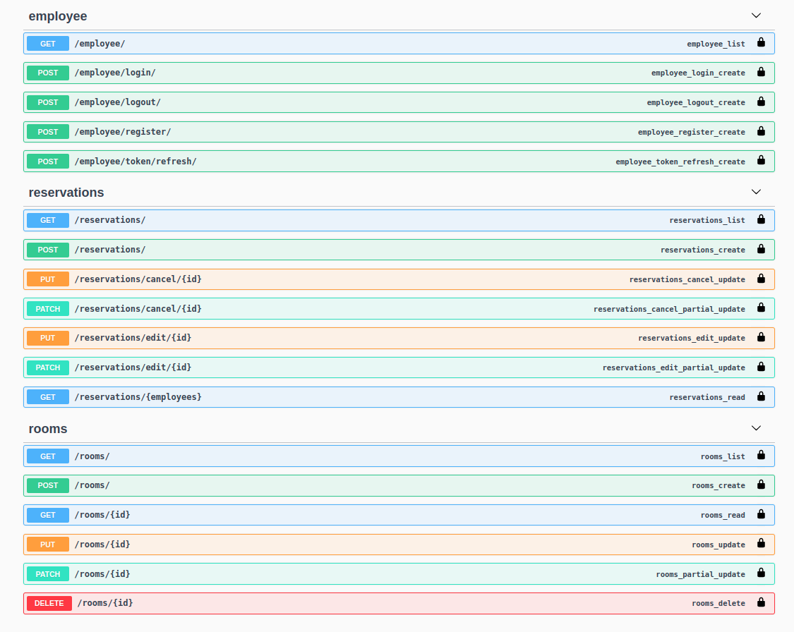 
</p>

## Run in local without docker

Create the virtual environment

```
$ virtualenv -p python3 .
```

Activate the virtual environment

```
$ source bin/activate
```

Create file .env in the root project that consists of credentials information related to your database, the required variables are as below :

```
DATABASE_NAME=your_database_name
DATABASE_USER=your_database_user
DATABASE_PASSWORD=your_database_password
DATABASE_ROOT_PASSWORD=your_root_database_password
DATABASE_HOST=your_host
DATABASE_PORT=your_port
```

Initialize mysql database by executing below script

```
$ script/dbinit.sh
```

Install python library in file requirements.txt

```
$ pip install -r requirements.txt
```

Create and run the migrations by running

```
$ script/migrate.sh
```

- Developer notes : If you want to create a new migrations, you have to execute `python manage.py makemigrations` beforehand

If you need a superuser to see the django admin, you can execute below script

```
$ script/createsuperuser.sh

```

- Developer notes : Sometimes you still cannot access the django admin, try to change the password with `python manage.py changepassword [email]`

Run server with below command

```
$ script/runserver.sh
```

To deactivate virtual env, you can run below command on your terminal

```
$ deactivate
```

## Run in local with docker

Create file .env in the root project that consists of credentials information related to your database, the required variables are as below :

```
DATABASE_NAME=your_database_name
DATABASE_USER=your_database_user
DATABASE_PASSWORD=your_database_password
DATABASE_ROOT_PASSWORD=your_root_database_password
DATABASE_HOST=your_host  // use 'db' refers to docker-compose
DATABASE_PORT=your_port
```

To run the server with docker, execute below command :

```
$ set -a && source docker.env && set +a
$ docker-compose build
$ docker-compose up
```

- Developer notes :

  - <p>In this project i used image ubuntu:bionic, and the update/installation could take quite some time &#128532;</p>

  - Run `docker-compose build` only at the first time. If there is any changes on the apps, use `docker-compose up`

## Run test and coverage

To run test the whole projects use below command

```
$ coverage run manage.py test
```

Generate the coverage report with below command

```
$ coverage report
$ coverage html
```

File `htmlcov/index.html` will be created, you can open it in your browser and check the result

## How to use APIs

Once you run the server, you can go to `http://localhost:8000` and you will see the swagger API

<p align="center">
    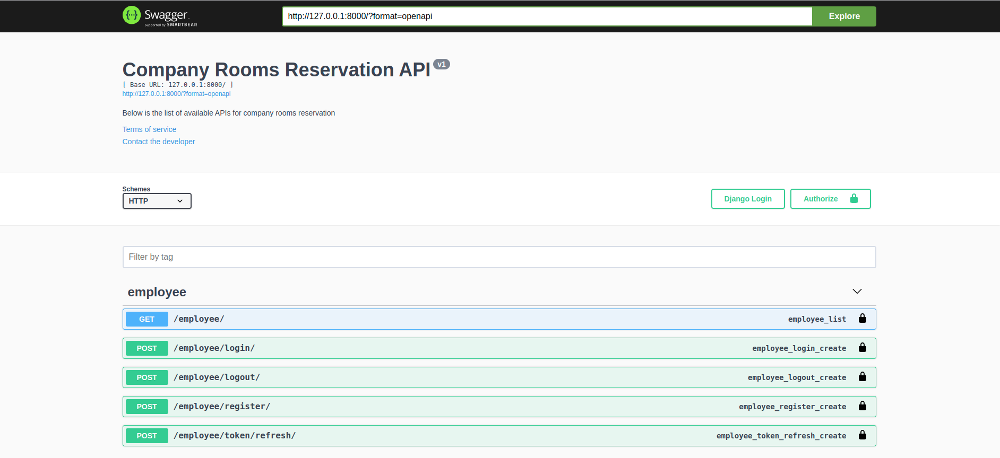 
    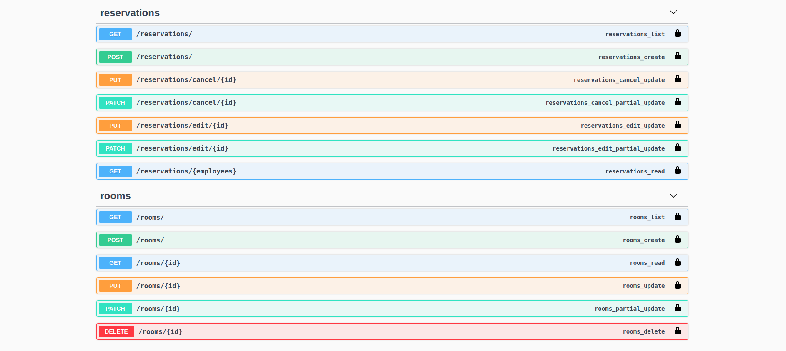 
</p>

There are few example of how to use the APIs shown below :

- Authorization

The authorization will be required for all APIs except `employee/login` and `employee/register`. To add the authorization, you can choose the padlock symbol and enter the access token from `employee/login`

<p align="center">
    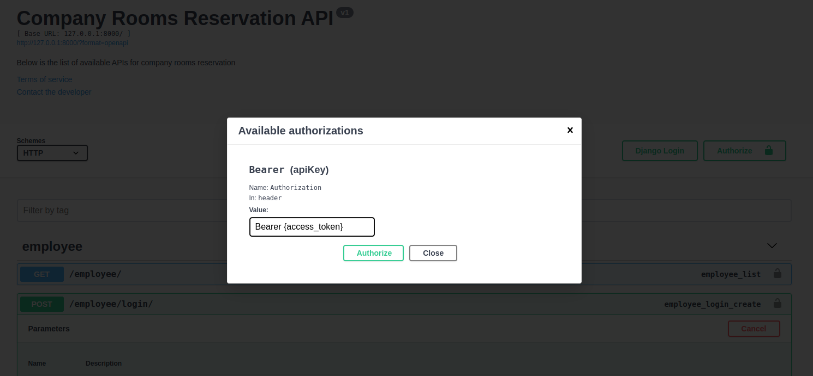 
</p>

- Employee-Login : First you have to login with email and password, if the authentication successfull you will get an access token and refresh token.

<p align="center">
    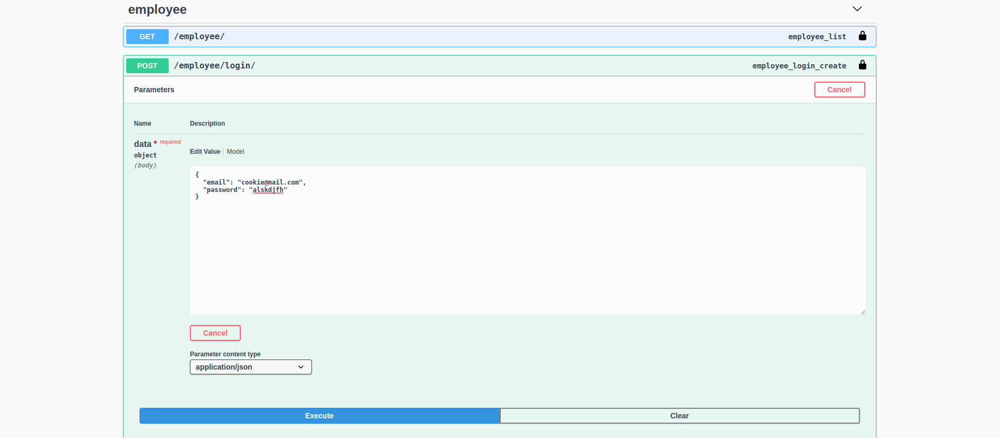 
    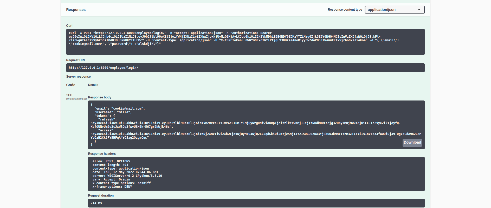 
</p>

- Employee-Register : See the example below to register your employee

<p align="center">
    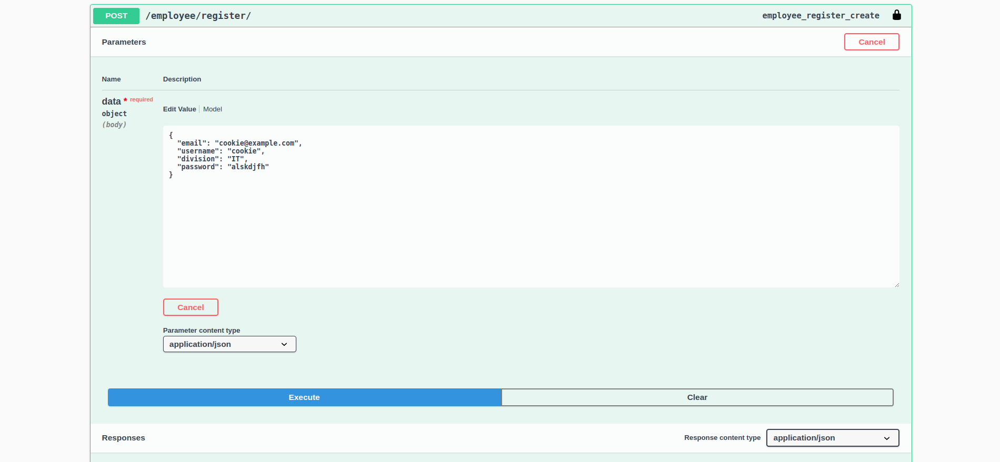 
</p>

- Room-Get : See the example below to get all rooms

<p align="center">
    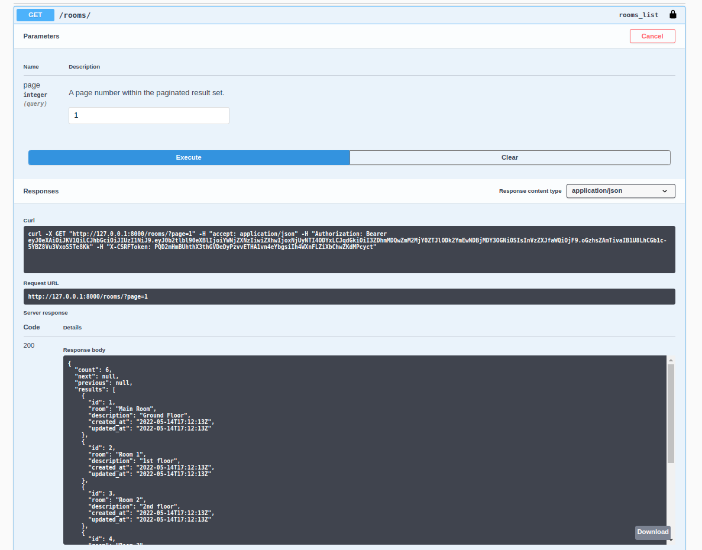 
</p>

- Reservations-Create : See the example below to create reservation

<p align="center">
    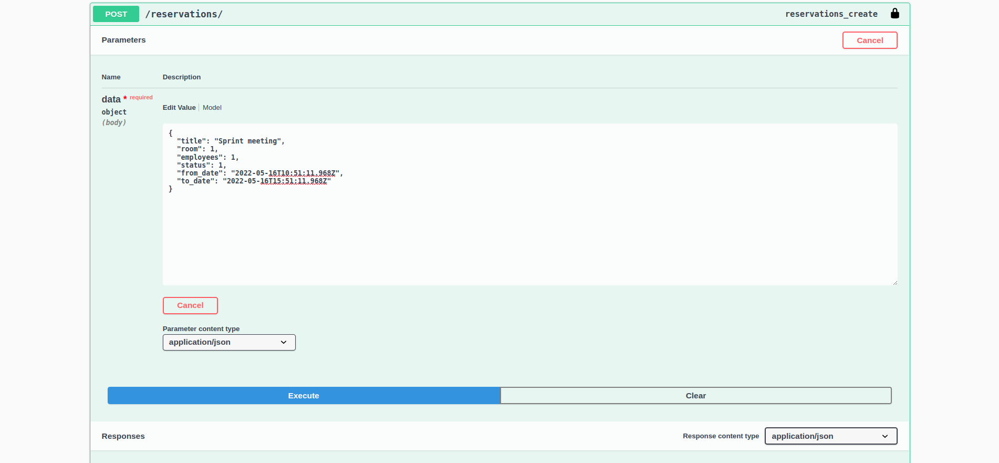 
    <p>Responses : </p>
    <p>Successful : Reservations created</p>
    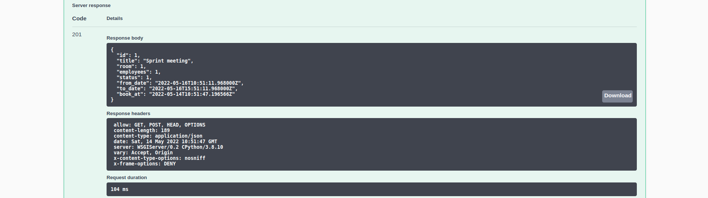 
    <p>Bad request : Room occupied</p>
    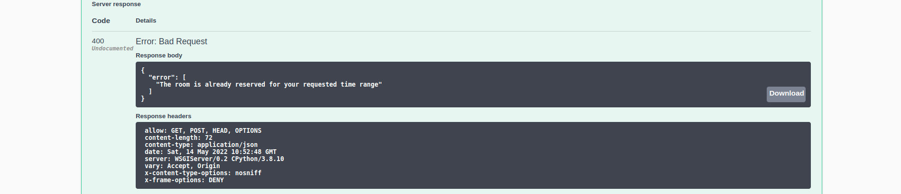 
    <p>Bad request : Meeting date started befor current time</p>
    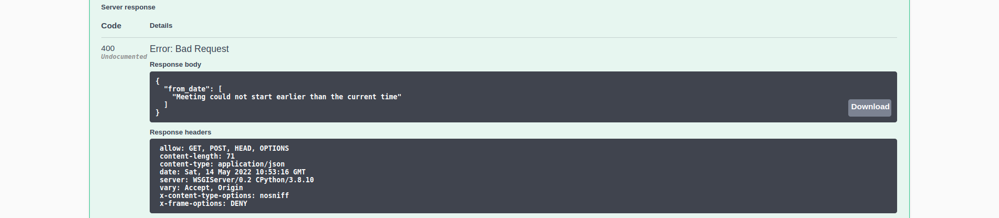 
</p>

- Reservations-Cancel : See the example below to get all cancel reservation

<p align="center">
     
    <p>Responses : </p>
    <p>Successful : Reservations cancelled</p>
    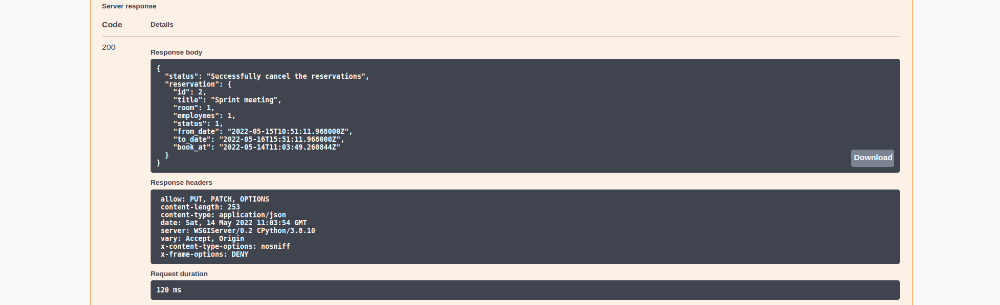 
    <p>Bad request : Reservations not found</p>
    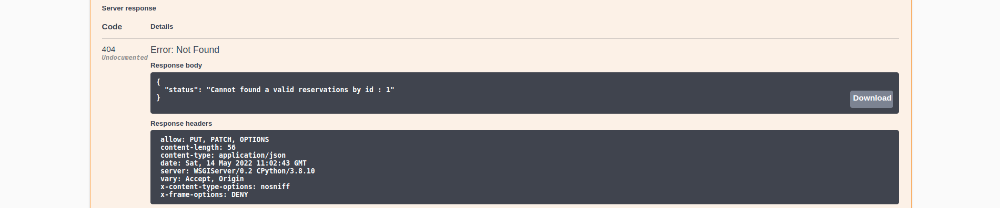 
    <p>Forbidden : You don't have the permission to perform this action (try to cancel other's meeting)</p>
    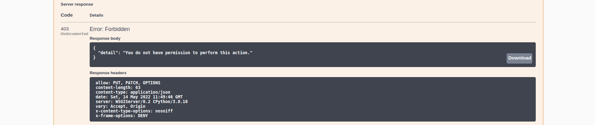 
</p>

- Logout : To logout from the server you need to provide the refresh token
<p align="center">
    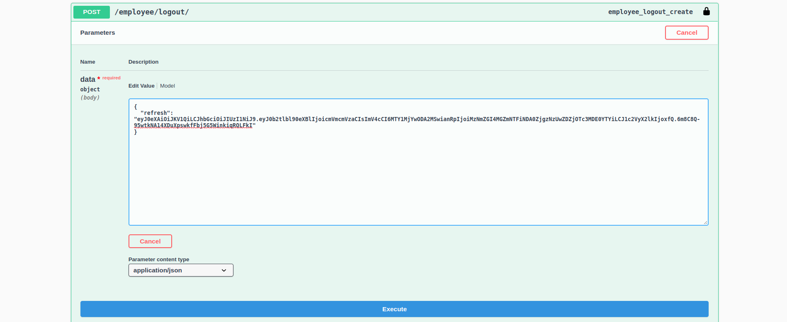 
</p>

## Project Structures

```
company-rooms-reservation
├─ Dockerfile
├─ README.md
├─ authentication             // This apps to handle employees authentications
│  ├─ __init__.py
│  ├─ admin.py
│  ├─ apps.py
│  ├─ models.py
│  ├─ renderers.py
│  ├─ serializers.py
│  ├─ tests
│  ├─ urls.py
│  ├─ utils.py
│  └─ views.py
├─ docker-compose.yml
├─ docs                       // Consists of related screenshots/documents of the projects
├─ main                       // Main applications
│  ├─ asgi.py
│  ├─ common.py
│  ├─ settings.py
│  ├─ urls.py
│  ├─ utils.py
│  └─ wsgi.py
├─ manage.py
├─ pyvenv.cfg
├─ requirements.txt
├─ reservations               // This apps to handle room reservations
│  ├─ admin.py
│  ├─ apps.py
│  ├─ models.py
│  ├─ permissions.py
│  ├─ serializers.py
│  ├─ tests.py
│  ├─ urls.py
│  ├─ validators.py
│  └─ views.py
├─ rooms                      // This apps to handle rooms creation, deletion, edit etc
│  ├─ admin.py
│  ├─ apps.py
│  ├─ migrations
│  ├─ models.py
│  ├─ permissions.py
│  ├─ serializers.py
│  ├─ tests.py
│  ├─ urls.py
│  └─ views.py
└─ script                     // Consists of useful scripts for development purposes

```

## Technologies

This project is mainly created with:

- Django version: 3.0.7
- Django Rest Framework version: 3.11.0
- Docker version: 20.10.14
- docker-compose version: 1.29.2
- MySQL version: 8.0.29
- Python versio: 3.8.10
- Swagger/OpenAPI version: 1.17.1

