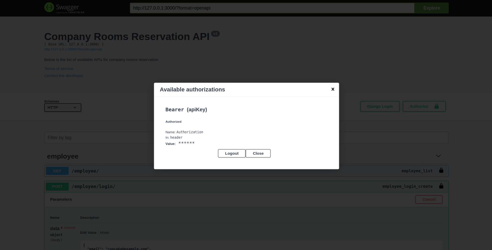
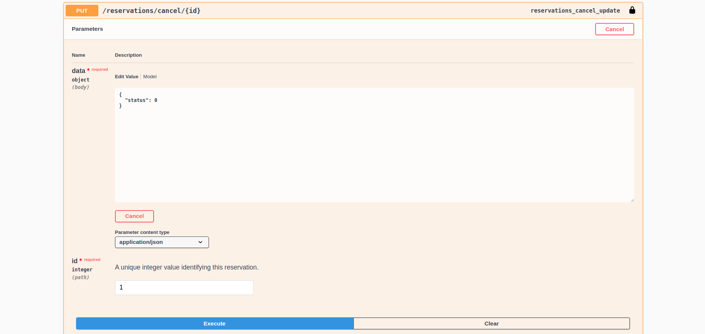
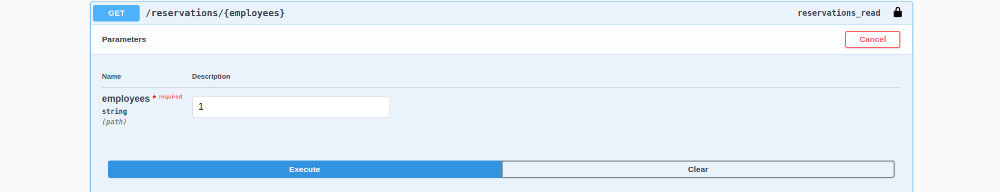
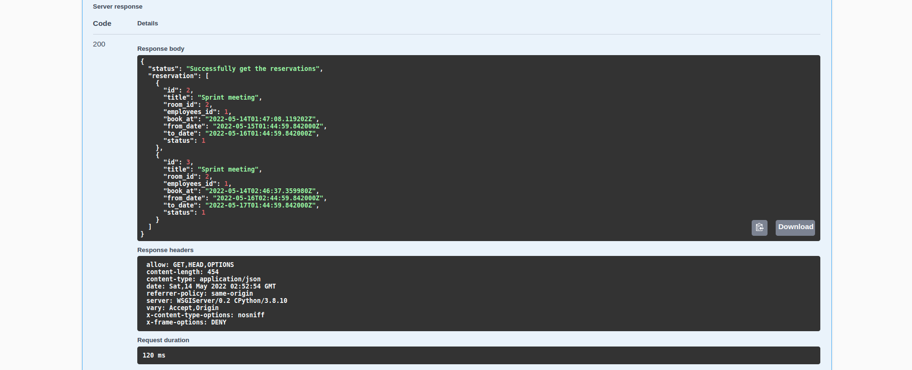

# Company Rooms Reservation

Company needs an internal service for its employees which helps them to reserve company
meeting rooms for internal or external meetings. Each employee should be able to check each
room’s availability, book or cancel a reservation through an API.

## Table of Contents

- [Company Rooms Reservation](#company-rooms-reservation)
  - [Table of Contents](#table-of-contents)
  - [Technologies](#technologies)
  - [Available APIs](#available-apis)
  - [Run in local without docker](#run-in-local-without-docker)
  - [Run in local with docker](#run-in-local-with-docker)
  - [Run test and coverage](#run-test-and-coverage)
  - [How to use APIs](#how-to-use-apis)
    - [Authorization](#authorization)
    - [Employee - Login](#employee---login)
    - [Employee - Register](#employee---register)
    - [Employee - Logout](#employee---logout)
    - [Rooms - Get](#rooms---get)
    - [Reservations - Create](#reservations---create)
    - [Reservations - Cancel](#reservations---cancel)
    - [Reservations - Filter by Employee](#reservations---filter-by-employee)
  - [Project Structures](#project-structures)

## Technologies

This project is mainly created with:

- Django version: 3.0.7
- Django Rest Framework version: 3.11.0
- Docker version: 20.10.14
- docker-compose version: 1.29.2
- MySQL version: 8.0.29
- Python version: 3.8.10
- Swagger/OpenAPI version: 1.17.1

## Available APIs

The available APIS for Company Rooms Reservation projects are listed below

<p align="center">
     
</p>

## Run in local without docker

Create the virtual environment

```
$ virtualenv -p python3 .
```

Activate the virtual environment

```
$ source bin/activate
```

Create file .env in the root project that consists of credentials information related to your database, the required variables are as below :

```
DATABASE_NAME=your_database_name
DATABASE_USER=your_database_user
DATABASE_PASSWORD=your_database_password
DATABASE_ROOT_PASSWORD=your_root_database_password
DATABASE_HOST=your_host
DATABASE_PORT=your_port
```

Initialize mysql database by executing below script

```
$ script/dbinit.sh
```

Install python library in file requirements.txt

```
$ pip install -r requirements.txt
```

Create and run the migrations by running

```
$ script/migrate.sh
```

- Developer notes : If you want to create a new migrations, you have to execute `python manage.py makemigrations` beforehand

If you need a superuser to see the django admin, you can execute below script

```
$ script/createsuperuser.sh

```

- Developer notes : Sometimes you still cannot access the django admin, try to change the password with `python manage.py changepassword [email]`

Run server with below command then you can access the server at http://127.0.0.1:8000/

```
$ script/runserver.sh
```

To deactivate virtual env, you can run below command on your terminal

```
$ deactivate
```

## Run in local with docker

Create file .env in the root project that consists of credentials information related to your database, the required variables are as below :

```
DATABASE_NAME=your_database_name
DATABASE_USER=your_database_user
DATABASE_PASSWORD=your_database_password
DATABASE_ROOT_PASSWORD=your_root_database_password
DATABASE_HOST=your_host  // use 'db' refers to docker-compose
DATABASE_PORT=your_port
```

To run the server with docker, execute below command :

```
$ set -a && source docker.env && set +a
$ docker-compose build
$ docker-compose up
```

- Developer notes :

  - <p>In this project i used image ubuntu:bionic, and the update/installation could take quite some time &#128532;</p>

  - During the `docker-compose up` you may get `Socket.Timeout error`or `No matching distribution found`. If that happens you could do :

    - try to restart docker : `sudo systemctl restart docker`

  - Run `docker-compose build` only at the first time. If there is any changes on the apps, use `docker-compose up`

  - On current condition, everytime we run the `docker-compose up` the database will be initialize

Then you can access the server at http://0.0.0.0:8000/

## Run test and coverage

To run test the whole projects use below command

```
$ coverage run manage.py test
```

Generate the coverage report with below command

```
$ coverage report
$ coverage html
```

File `htmlcov/index.html` will be created, you can open it in your browser and check the result

## How to use APIs

Once you run the server, you will see the swagger API page

<p align="center">
     
     
</p>

There are few example of how to use the APIs shown below :

### Authorization

The authorization will be required for all APIs except `employee/login` and `employee/register`. To add the authorization, you can choose the padlock symbol and enter the access token from `employee/login` and click **Authorize**

<p align="center">
     
</p>

### Employee - Login

To login you need to provide email and password, if the authentication successfull you will get an access token and refresh token.

<p align="center">
     
     
</p>

### Employee - Register

See the example below to register your employee

<p align="center">
     
</p>

### Employee - Logout

To logout from the server you need to provide the refresh token

<p align="center">
     
</p>

You should clear the authorizations as well by clicking the padlock symbol and click **logout**

<p align="center">
     
</p>

### Rooms - Get

See the example below to get all rooms

<p align="center">
     
</p>

### Reservations - Create

See the example below to create reservation

<p align="center">
     
    <p>Responses : </p>
    <p>Successful : Reservation is created</p>
     
    <p>Bad request : Room is occupied</p>
     
    <p>Bad request : Meeting date started before the current time</p>
     
</p>

### Reservations - Cancel

See the example below to get all cancel reservation

<p align="center">
     
    <p>Responses : </p>
    <p>Successful : Reservation is cancelled</p>
     
    <p>Bad request : Reservation is not found</p>
     
    <p>Forbidden : You don't have the permission to perform this action (try to cancel other's meeting)</p>
     
</p>

### Reservations - Filter by Employee

See the example below to get all reservation filtered by employee id

<p align="center">
     
    <p>Responses : </p>
    <p>Successful : Reservations successful</p>
      
</p>

## Project Structures

```
company-rooms-reservation
├─ Dockerfile
├─ README.md
├─ authentication             // This apps to handle employees authentications
│  ├─ __init__.py
│  ├─ admin.py
│  ├─ apps.py
│  ├─ models.py
│  ├─ renderers.py
│  ├─ serializers.py
│  ├─ tests
│  ├─ urls.py
│  ├─ utils.py
│  └─ views.py
├─ docker-compose.yml
├─ docs                       // Consists of related screenshots/documents of the projects
├─ main                       // Main applications
│  ├─ asgi.py
│  ├─ common.py
│  ├─ settings.py
│  ├─ urls.py
│  ├─ utils.py
│  └─ wsgi.py
├─ manage.py
├─ pyvenv.cfg
├─ requirements.txt
├─ reservations               // This apps to handle room reservations
│  ├─ admin.py
│  ├─ apps.py
│  ├─ models.py
│  ├─ permissions.py
│  ├─ serializers.py
│  ├─ tests.py
│  ├─ urls.py
│  ├─ validators.py
│  └─ views.py
├─ rooms                      // This apps to handle rooms creation, deletion, edit etc
│  ├─ admin.py
│  ├─ apps.py
│  ├─ migrations
│  ├─ models.py
│  ├─ permissions.py
│  ├─ serializers.py
│  ├─ tests.py
│  ├─ urls.py
│  └─ views.py
└─ script                     // Consists of useful scripts for development purposes

```

